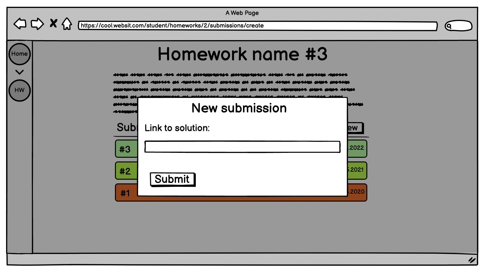
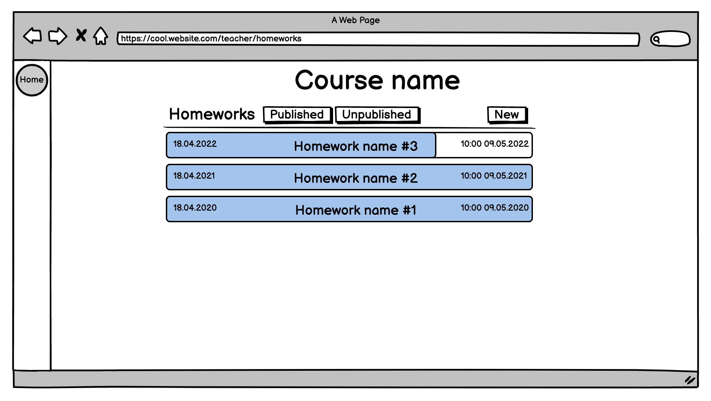
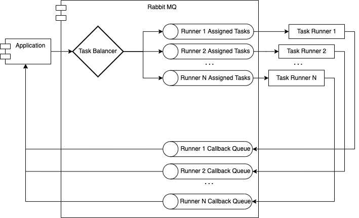

# Архитектура MyHwProj

## Разработчики
- Бубнов Данил
- Марьин Глеб
- Лучинин Алексей
- Онофрийчук Илья

## Глоссарий
Раннер — компонент, который занимается проверкой решения студента с помощью программы указанной преподавателем

## Общие сведения о системе

### Назначения системы
MyHwProj — система для проверки домашних заданий студентов

### Границы системы
- Один студент
- Один преподаватель
- Аутентификации нет
- Должен быть веб интерфейс
- Должен быть REST API
- Изменять/удалять домашнюю работу или попытку решения нельзя

### Контекст системы
Система должна предоставлять веб интерфейс, а также REST API для интеграции с другими системами

## Architectural drivers

### Технические ограничения
- Для выбранного языка программирования должны быть библиотеки для работы с RabbitMQ, HTTP шаблонами и PostgreSQL

### Бизнес ограничения
- Для разработки системы будет около 1 недели

### Качественные характеристики системы
- Способность выдерживать большое число запросов не нужна
- Должна быть возможность масштабирования раннеров

### Ключевые функциональные требования
- Система должна балансировать нагрузку между раннерами

## Архитектурные виды

### Роли и случаи использования
Роли:
- Студент
- Преподаватель

Случаи использования:
- Студент:
  - просмотреть список домашних работ, отсортированный по близости дедлайна, причём должны показываться только работы, дата публикации которых уже наступила
  - сдать решение в виде ссылки на GitHub
  - для конкретной домашней работы просмотреть список результатов, отсортированный по дате сдачи
  - просмотреть детальную информацию о попытке включая текстовый вывод раннера
- Преподаватель:
  - добавить новую домашнюю работу
  - для конкретной домашней работы просмотреть список результатов, отсортированный по дате сдачи
  - просмотреть детальную информацию о попытке включая текстовый вывод раннера

### Композиция

#### Client (Website)
Сайт для студента или преподавателя

#### Other App
Система, которая хочет интегрироваться с нашей

#### HwProj App
Основной веб сервис, который содержит всю бизнес-логику. Все запросы направляются ему

#### Postgres DB
База данных, в которой хранятся все данные сервиса. Сервис общается с ней с помощью ORM библиотеки

#### Rabbit MQ
Сервер с RabbitMQ через который сервис общается с раннерами. Балансирует нагрузку между раннерами

#### Worker n
Один из раннеров. Проверяет решения студентов и отравляет вердикт сервису обратно через очередь

### REST API
SwaggerUI: [https://kaperd.github.io/HSE-SD-MyHwProj/](https://kaperd.github.io/HSE-SD-MyHwProj/)

OpenAPI спецификация: [open-api.yaml](open-api.yaml)

### Макеты веб страниц: Студент

#### Домашние работы

#### Просмотр домашней работы и попыток её решения

#### Просмотр попытки решения

#### Создать попытку решения

### Макеты веб страниц: Преподаватель

#### Домашние работы

#### Просмотр домашней работы и попыток её решения

#### Просмотр попытки решения

#### Создать домашнюю работу

### Логическая структура основного сервиса

### ER диаграмма базы данных

## Взаимодействие с очередью заданий
В качестве очереди мы используем Rabbit MQ. Рассмотрим сценарий, когда студент сдаёт задачу в виде ссылки на GitHub.

- Посылка отправляется на проверку в очередь с посылками RabbitMQ. Точнее: она посылается на Exchange, где дальше происходит её распределение.
- Exchange делает балансировку по раннерам (распределение на диаграмме обозначено как Task Balancer) по стратегии Round-robin. Но при этом если раннер, который должен сейчас запуститься всё ещё не закончил предыдущую задачу, то он пропускается на этой итерации. Таким образом подбирается конкретный раннер и ему назначается задача проверки (назначенные задачи на диаграмме отображены очередями Runner N Assigned Tasks).
- Назначенный раннер выполняет проверку задания и генерирует отчёт
- Отчёт кладётся в отдельную очередь, которая для каждого раннера своя (Runner N Callback Queue). В очередь задание попадает также через Exchange.
- Application через очередь получает отчёт о проверенном домашнем задании.

